# Generating complex natural videos with Wasserstein GANs

This repository uses a Wasserstein GAN with gradient penalty [(arxiv.org/pdf/1704.00028.pdf)](https://arxiv.org/pdf/1704.00028.pdf) to learn the latent space dynamics of short video clips. It is trained on the full [YouTube Bounding Box](https://research.google.com/youtube-bb/) dataset. The backgrounds are dynamic and the entire video stream is mostly kept as read-in, not separating foreground and background streams. Implemented in [Chainer](https://docs.chainer.org/en/stable/index.html). Here are some examples of the output generations:

<div class="row">
<center>
  <div class="column">
    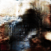
    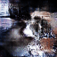
    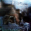
    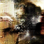
    
    
  </div>
  <div class="column">
    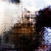
    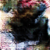
    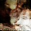
    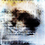
    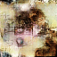
    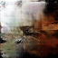
    </div>
  <div class="column">
    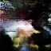
    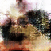
    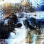
    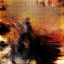
    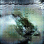
    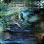
    </div>
  <div class="column">
    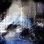
    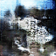
    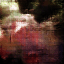
    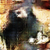
    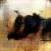
    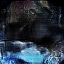
    </div>
  <div class="column">
    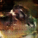
    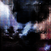
    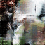
    
    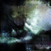
    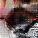
    </div>
</center>
</div>

## File overview of this repository

```bash
| Overview ───────────────────────────────────────────────────────────────────────────────────────────|
|
├── main_train.py :: main training file. loads parameter configurations from setup.ini.
├── setup.ini :: initialization file to specify training procedures.
├── computations
│   ├── trainer.py :: instance of chainer.trainer that specifies training procedure and writes the gifs.
│   ├── updater.py :: instance of chainer.updater that implements wasserstein loss with gradient penalty.
├── datastream
│   ├── framereader.py :: datastream pipeline including preprocessing of videos.
│   ├── download_plain.py :: download videos from the youtube bounding box dataset.
│   ├── split_video.py :: cut or extend videos downloaded from the youtube dataset to equal length.
├── nn
│   ├── DCGAN.py :: defines the architecture of the generator and discriminator network.
├── models
│   ├── generator.npz :: the trained generator network that produces videos
├── utils
│   ├── generate.py :: generate gifs of size 64x64 with 32 frames with a pretrained model.
│   ├── config_parse.py :: load .ini file into object like format.
└── .
```

## Requirements

* python - 3.7.3
* chainer - 6.1.0
* numpy - 1.17.3
* PIL - 5.4.1
* imageio - 2.5.0
* cv2 - 4.1.0

## How to use this code?

The start is to have a database of short video clips. Either use the methods defined in the datastream directory to download parts of the YouTube bounding box dataset, or use your own one. For further details see the dataset described in [Bernhard Kratzwalds project page](https://bernhard2202.github.io/ivgan/index.html). Specify the resolution of the processed videos in the `setup.ini` file. This will manually crop or stack the videos to the size specified during training.

To start the actual training procedure, fill out the remaining configuration in the .ini file. Then simply execute `python main_train.py` to run the main script. Specify your CUDA GPU correctly. Due to sequential GAN updates, it is unfortunately not easily possible to distribute training across multiple GPUs.

All models including the discriminator, generator and the entire trainer object to resume training can be downloaded
from https://cloud.mahner.space/index.php/s/aLELzKMnCXtb8x8. A corresponding report explaining all further details of computation can also be downloaded from the same directory.


## How to generate further videos?

If using the provided pretrained generator, simply execute `python generate.py` and specify the number of videos you want to create on the top of the file.

## Acknowledgements:

[Generating Videos With Scene Dynamics](http://www.cs.columbia.edu/~vondrick/tinyvideo/paper.pdf) - Carl Vondrick et al. <br>
[Improving Video Generation for Multi-functional Applications](https://arxiv.org/abs/1711.11453) - Kratzwald et al.


Enjoy!
